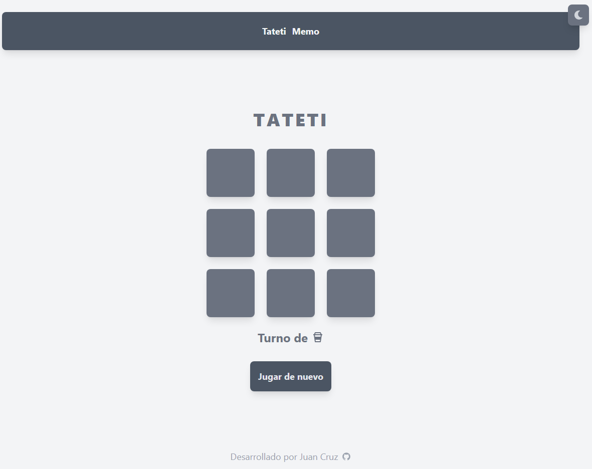
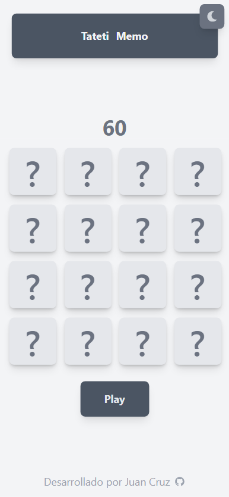

# Board Games with Typescript + Vite

[https://board-games-self.vercel.app](https://board-games-self.vercel.app/)

<div style="justify-content: center;
    display: flex;
    flex-direction: column;
    align-items: center;
    width: 100%;
    margin-bottom: 1rem;
    margin-top: 1rem;
    border-radius: 0.5rem;
    border: 1px solid #eaeaea;
    padding: 1rem;
">
<h2>Web</h2>

<h2>Mobile</h2>

</div>
### Description

<p
    style="text-align: justify !important; font-size: 1rem;" 
    width="100%"
>
    This is a simple project to practice Typescript and Vite. It is a board game store, where you can see the games, add them to the cart and buy them. The data is stored in a JSON file.
</p>

### Installation

##### Clone the repository and install the dependencies.

```bash
git clone
cd board-games
npm install
```

### Usage

##### Run the application in development mode.

```bash
npm run dev
```

##### Build the application for production.

```bash
npm run build
```

##### Run the application in production mode.

```bash
npm run start
```
